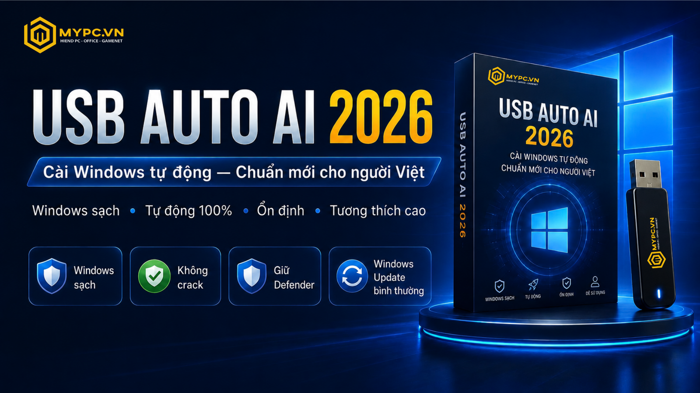

# USB AUTO AI 2026

**Cài Windows tự động — Chuẩn mới cho người Việt**

> Windows sạch. Tự động. Ổn định. Tương thích cao.

UsbAutoAI là nền tảng cài đặt Windows tự động của **MYPC.VN**, được xây dựng để giúp việc cài lại Windows trở nên sạch hơn, ổn định hơn và dễ kiểm soát hơn.

Đại diện kỹ thuật: **LongFix**.

---

> **Nền tảng cài đặt Windows tự động hiện đại dành cho người Việt.**
>
> - Windows sạch
> - Tự động 100%
> - Không crack
> - Không mod sâu
> - Dễ sử dụng
> - Phù hợp cá nhân, kỹ thuật viên và doanh nghiệp

---

> Muốn cài lại Windows nhanh, sạch và ổn định hơn?
>
> **UsbAutoAI giúp bạn rút gọn quy trình cài Windows chỉ còn: Cắm USB → Boot máy → Chọn bộ Windows → Tự động cài đặt.**

- **Liên hệ MYPC.VN để mua UsbAutoAI**
- [Xem hướng dẫn cài đặt](docs/installation.md)
- [Xem các bộ Windows hỗ trợ](docs/editions.md)
- [Xem câu hỏi thường gặp](docs/faq.md)

---

## UsbAutoAI là gì?

UsbAutoAI giúp đơn giản hóa quá trình cài đặt Windows. Người dùng chỉ cần cắm USB, boot máy, chọn bộ Windows phù hợp và để hệ thống tự động xử lý các bước còn lại.

Sản phẩm không biến Windows thành một bản lạ hoặc khó bảo trì. UsbAutoAI tập trung vào **quy trình cài đặt sạch, rõ ràng và có thể lặp lại**.

## Vì sao UsbAutoAI ra đời?

Cài Windows thủ công vẫn có nhiều điểm rườm rà:

- Nhiều bước kỹ thuật, dễ nhầm nếu không quen.
- Cài driver và cập nhật sau cài mất thời gian.
- Bộ cài không rõ nguồn gốc có thể kèm rủi ro về ổn định, bảo mật và bản quyền.
- Kỹ thuật viên cần một quy trình nhanh hơn khi xử lý nhiều máy.
- Doanh nghiệp cần môi trường Windows sạch, nhất quán và dễ hỗ trợ.

UsbAutoAI ra đời để đưa các bước quan trọng vào một quy trình gọn hơn, dễ theo dõi hơn và phù hợp với nhu cầu thực tế tại Việt Nam.

## UsbAutoAI khác gì USB boot truyền thống?

| Tiêu chí | USB boot truyền thống | Ghost Win | UsbAutoAI |
| --- | --- | --- | --- |
| Mức độ tự động | Thấp, nhiều thao tác thủ công | Trung bình, phụ thuộc bản đóng gói | Cao, giảm các bước lặp lại |
| Độ dễ sử dụng | Cần hiểu kỹ thuật | Dễ dùng ban đầu nhưng khó kiểm soát | Dễ dùng, quy trình rõ ràng |
| Kiểm soát nguồn Windows | Phụ thuộc người tạo USB | Khó xác minh đầy đủ | Dựa trên Windows Microsoft gốc |
| Windows Update | Hoạt động nếu bộ cài chuẩn | Có thể bị ảnh hưởng | Được giữ hoạt động bình thường |
| Defender | Phụ thuộc cấu hình người cài | Có thể bị tắt hoặc chỉnh sâu | Được giữ lại |
| Phần mềm rác/crack | Phụ thuộc nguồn bộ cài | Rủi ro cao hơn | Không crack, không ép cài phần mềm rác |
| Phù hợp doanh nghiệp | Cần nhân sự kỹ thuật | Không khuyến nghị | Phù hợp môi trường cần chuẩn hóa |
| Tính ổn định dài hạn | Tốt nếu thao tác đúng | Phụ thuộc chất lượng bản đóng gói | Ưu tiên ổn định và tương thích cao |

UsbAutoAI không phải Ghost Win, không phải công cụ crack, không phải USB boot truyền thống và không phải bản Windows Lite/mod sâu.

## Windows sạch thế hệ mới

Triết lý của MyPC là giữ Windows sạch theo cách thực tế: **ít phiền nhiễu hơn, nhưng không cắt gọt cực đoan**.

- Không quảng cáo.
- Không crack.
- Không mod sâu.
- Không phần mềm rác.
- Dựa trên Windows Microsoft gốc.
- Giữ Windows Defender.
- Windows Update hoạt động bình thường.
- Ưu tiên ổn định, tương thích và khả năng bảo trì.

Đây là hướng tiếp cận dành cho người dùng muốn cài lại Windows với sự an tâm: sạch hơn, gọn hơn, nhưng vẫn giữ những thành phần quan trọng của hệ điều hành.

## Các bộ Windows hỗ trợ

| Bộ Windows | Định hướng |
| --- | --- |
| Windows 10 22H2 by MyPC | Lựa chọn ổn định cho máy phổ thông và máy cần Windows 10 |
| Windows 11 23H2 by MyPC | Windows 11 sạch, hiện đại, phù hợp sử dụng hằng ngày |
| Windows 11 25H2 by MyPC | Hướng tới chuẩn Windows mới của MyPC trong năm 2026 |
| Windows 10 Microsoft Original | Bản Microsoft gốc cho nhu cầu giữ nguyên mặc định |
| Windows 11 Microsoft Original | Bản Microsoft gốc cho thiết bị đời mới |

**by MyPC** phù hợp khi cần Windows sạch hơn, gọn hơn và sẵn sàng sử dụng hơn sau khi cài.

**Microsoft Original** phù hợp khi cần môi trường gần với mặc định của Microsoft nhất.

## Quy trình sử dụng

| Bước | Thao tác |
| --- | --- |
| 1 | Cắm USB UsbAutoAI |
| 2 | Boot máy từ USB |
| 3 | Chọn bộ Windows cần cài |
| 4 | Chờ hệ thống tự động hoàn tất |

Quy trình được thiết kế để giảm thao tác kỹ thuật, đặc biệt hữu ích khi cần cài lại nhiều máy hoặc cần kết quả nhất quán.

## Ai nên dùng?

- **Người dùng cá nhân**: cài lại Windows sạch, dễ hiểu, ít phụ thuộc kỹ thuật viên.
- **Kỹ thuật viên**: tiết kiệm thời gian và giảm sai sót khi xử lý nhiều máy.
- **Cửa hàng máy tính**: chuẩn hóa chất lượng cài đặt cho khách hàng.
- **Văn phòng/doanh nghiệp nhỏ**: triển khai môi trường Windows sạch, dễ cập nhật và dễ hỗ trợ.
- **Phòng net/gaming center**: rút gọn quy trình cài lại và bảo trì hệ thống.

## Cam kết an toàn

UsbAutoAI được định vị là nền tảng cài đặt Windows sạch và hợp lệ. Sản phẩm không thay thế giấy phép phần mềm và không khuyến khích bất kỳ hình thức vi phạm bản quyền nào.

- Không malware.
- Không đào coin.
- Không backdoor.
- Không phá Windows Update.
- Không tắt Defender.
- Không ép cài phần mềm không cần thiết.
- Không định hướng crack bản quyền.

## Lộ trình 2026

- **Windows by MyPC 2026 Core**: chuẩn Windows sạch hơn, ổn định hơn, dễ bảo trì hơn.
- **Cài app tùy chọn sau khi vào desktop**: người dùng chọn đúng ứng dụng mình cần.
- **Optimization Profiles**: hồ sơ tối ưu theo nhu cầu sử dụng.
- **MyPC Tool**: công cụ hỗ trợ cấu hình và bảo trì hệ thống.
- **LongFix AI**: đang bảo trì và sẽ trở lại trong thời gian tới.

## Bắt đầu

- [Xem hướng dẫn cài đặt](docs/installation.md)
- [Xem các bộ Windows hỗ trợ](docs/editions.md)
- [Tìm hiểu Windows sạch](docs/clean-windows.md)
- [Đọc FAQ trước khi mua](docs/faq.md)

**Cài lại Windows chưa bao giờ đơn giản đến vậy.**
